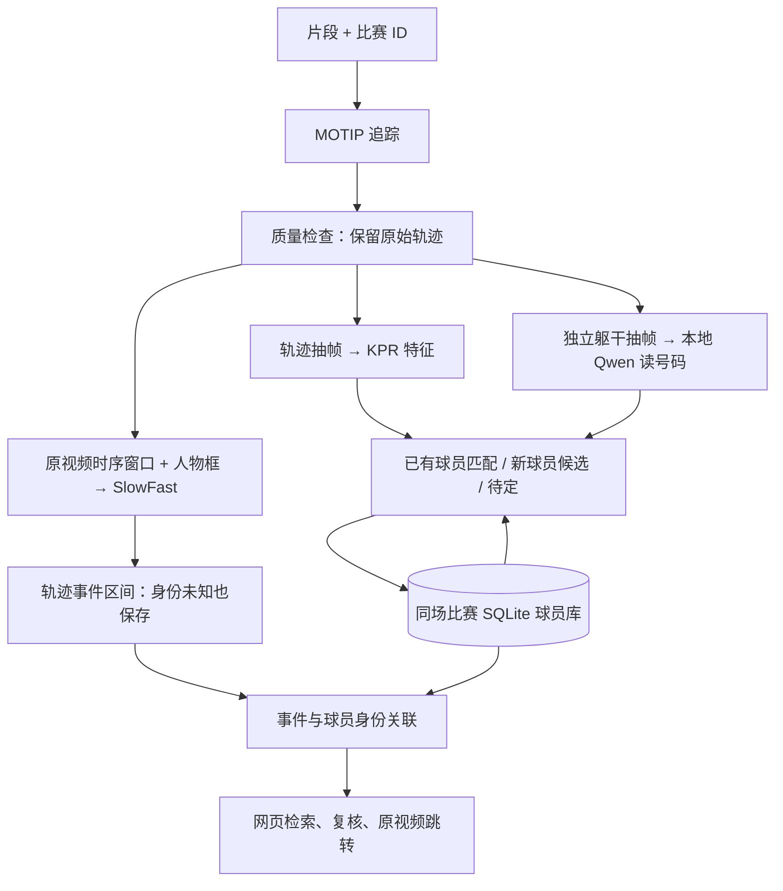

# CourtVision · 篮球片段处理与增量球员库

处理**同一场比赛的短视频片段**：MOTIP 追踪人物，原有 MMAction2/SlowFast 识别动作，KPR 与本地 Qwen 视觉模型提供身份和号码证据；持续更新球员库，按球员与事件检索视频素材。

当前不做长视频切分、不跨比赛合并身份、不在线训练 KPR。球员库增量更新是数据库和样本图库更新，不等同于深度类别增量训练。OpenIncrement 可作为后续研究方向，第一版未引入它的训练代码。

## 处理链路



单 GPU 上按阶段串行执行，模型子进程退出后释放显存：

`tracking → quality → action → aggregate → identity → resolution → jersey → players → link → render → review`

`identity` 目标跳过动作支路。`resolution` 复用已有媒体整理和质量检查逻辑，正常链路不做片段内自动聚类；所有自动身份匹配由持久化球员库负责。

## 身份规则

- `match_id` 明确指定，一份输出目录只属于一场比赛。`clip_id` 内的 MOTIP 轨迹 ID 不能直接当作球员 ID。
- 初始片段形成球员候选；后续片段追加观察，不重新聚类旧成员。`PL-*` ID 创建后保持稳定。人工合并保留被合并 ID 的别名。
- KPR 模型固定，保存部位特征和可见性。图库最多保留 12 条合格轨迹原型，后续观察仍全部保存。第一版不自动替换已有图库样本，不把待定观察加入图库。
- 默认匹配距离 `0.2`，新人物距离 `0.5`，第一与第二候选距离差至少 `0.05`。这些是待验证的工程初值，不是概率或论文指标。
- 质量不足、缺乏可比部位、候选接近或号码冲突时保留待定。同一片段中时间重叠的不同轨迹不能自动合并；时间分离的碎片可以匹配。
- 号码从独立选出的清晰、足够大、时间分散的躯干图读取。Qwen 可以拒识，`0` 与 `00` 分开保存；至少两个间隔 0.25 秒的支持帧才产生号码候选，有冲突不做多数票掩盖。
- 相同号码不能单独证明同人。球队和姓名由人工标签补充，没有自动球队识别。裁判等人物可人工标记为非球员并停止用于图库匹配。
- 每条轨迹及时间范围保留来源，模型事件保存原始轨迹 ID。人工拆出/合并后重新导出事件关联，不重新跑网络。目前修正粒度为整个轨迹档案；轨迹内部 ID 切换仍需复核，尚未提供时间段拆分界面。

## 快速开始

CPU 开发和自检：

```bash
bash tools/setup_control.sh
.venv/bin/python -m cli.serve_web --env-file .env --host 0.0.0.0 --port 6006
```

仅在已有私人 `.env` 时使用 `--env-file`，否则省略。该服务没有登录认证，使用机器平台提供的受控端口访问，不直接暴露公网。

GPU 环境、模型权重和 4090 操作步骤见 [GPU 部署说明](docs/gpu.md)。模型 Python 分开配置于 `.env`，不需要 Qwen API 密钥。

```bash
# 必须先准备模型环境、权重与输入视频。
.venv/bin/python -m cli.check_runtime --env-file .env
.venv/bin/python -m cli.process_batch \
  --env-file .env --match-id game-001 \
  --input-dir runtime/data/game-001 \
  --output-dir runtime/outputs/game-001 --limit 3
```

新增片段放入同一输入目录，用同一 `match_id` 和输出目录再次运行。已有片段按签名断点续跑，新增片段依次入库；可以用 `--selection` 指定 JSON 视频列表及处理顺序。批次清单保留历史成员，不因本次只选部分片段而删除历史。

先运行 `--target identity` 的片段可以随后补充动作支路，无须重新提取已注册的 KPR 特征。

`--dry-run` 查看命令，不加载模型；`--target identity` 仅运行身份支路；`--skip-qwen` 显式运行 KPR-only 模式。CLI 与网页共用阶段命令和身份逻辑。网页中新建一个项目代表一场比赛，连续上传该比赛片段后运行完整流程即可自动更新库；已有批次可通过网页“导入结果”浏览。

## 文件职责与运行数据

| 目录 | 职责 |
| --- | --- |
| `pipeline/tracking` | MOTIP 适配、轨迹质量 |
| `pipeline/identity` | KPR、Qwen、号码证据、持久化身份匹配 |
| `pipeline/action`、`adapters/mmaction2` | SlowFast、时序采样、事件区间 |
| `workflows` | 共用任务编排、档案整理、入库、关联、重跑 |
| `contracts` | 框架无关的数据结构和运行配置 |
| `cli` | 批处理、自检、复核入口 |
| `web` | 网页检查、素材检索、人工修正 |
| `analysis` | 质量、事件与身份评估 |
| `MOTIP`、`MMAction2` | 保留的上游实现，不修改网络源码 |

运行数据、权重、外部 KPR 源码、模型环境和私人配置均忽略，不提交 Git：

```text
runtime/
  models/{motip,kpr,action,qwen}/
  data/game-001/*.mp4
  outputs/game-001/
    batch_manifest.json
    library/
      players.sqlite3           # 身份、观察、事件原始记录、别名及修正历史
      library_manifest.json     # 可浏览索引及版本
      people.jsonl
      identity_map.jsonl
      events.jsonl              # 包括无法关联身份的事件
    <clip-id>/
      tracking/                 # 原始 MOTIP 输出和视频元数据
      quality/                  # 筛选与审计，不覆盖原始轨迹
      identity_raw/             # 原始 KPR 图片、特征、元数据
      identity/                 # 可浏览档案、Qwen 裁剪/缓存/读数、注册标记
      action/                   # 原始动作点、轨迹事件、关联动作点
      visualization/
      analysis/track_review/
      pipeline.log
```

SQLite 是身份记录的事实来源，JSON 是网页索引。网页读取按修订号发布的不可变索引，避免处理中断时混读多个版本。事务和文件锁协调 CLI/网页操作。重复注册相同证据不改变 ID 或修订号；注册后的身份/事件证据不能被悄悄替换。重新提取特征、改变动作结果或切换模型时使用新的输出目录；`--force` 只重跑阶段，不删除身份历史。旧批后聚类格式不自动迁移到新库，应保留旧结果并创建新运行目录。

网页可确认身份、设置标签、合并同标签分组、拆出误归并成员、撤销拆出、标记非球员。并发修改需要匹配当前 revision。命令行也可用 `cli.review_player`，查看 `--help`。

## 验证与边界

```bash
.venv/bin/python -m cli.check_privacy
.venv/bin/python -m cli.check_quality
.venv/bin/python -m cli.check_evaluation
.venv/bin/python -m cli.check_track_review
.venv/bin/python -m cli.check_batch
.venv/bin/python -m cli.check_person_library
.venv/bin/python -m cli.check_qwen
.venv/bin/python -m cli.check_web
```

CPU 自检覆盖身份稳定、追加/重跑、开放集待定、质量门槛、事务回滚、特征兼容、号码拒识/冲突/缓存、事件保留、网页复核与检索。Qwen 测试注入合成读数，其他模型测试使用合成轨迹/特征；它们验证程序行为，不代表真实模型识别准确率。真实 MOTIP/KPR/SlowFast/Qwen 联合 GPU 推理必须在模型环境和权重准备后单独验证。

动作仍采用 MultiSports SlowFast。短于模型窗口以及片段边缘的窗口重复首尾帧补足，动作点标记 `temporal_padding`；事件时间始终处于实际片段内。补帧会降低可用时序证据，需要真实片段评估。框错误、轨迹混人和同队球衣相似仍是主要误差来源。

KPR 默认 `prompt_mode=none`；显式关键点提示需要另行提供，当前不自动生成关键点。第一版图库检索面向小规模比赛，尚未引入大规模向量索引或学习式拒识模型。

采用模型：[MOTIP](https://github.com/MCG-NJU/MOTIP)、[KPR](https://github.com/VlSomers/keypoint_promptable_reidentification)、[MMAction2](https://github.com/open-mmlab/mmaction2)、[Qwen2.5-VL](https://github.com/QwenLM/Qwen2.5-VL)。请遵守各上游模型、权重和数据许可。
