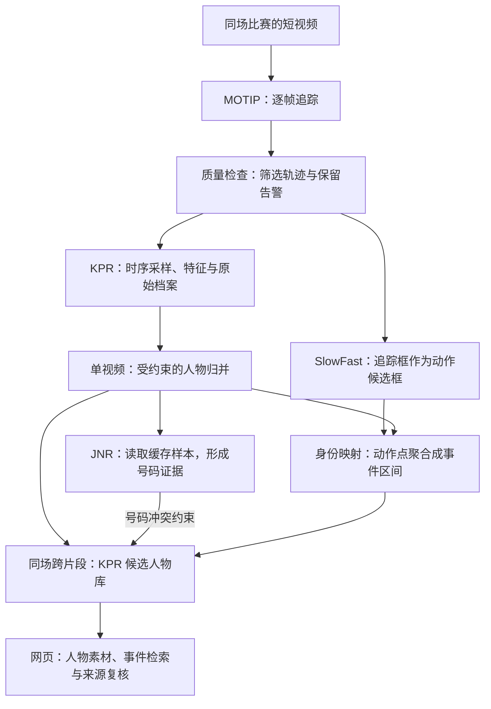

# CourtVision · 篮球视频人物素材归档

`basket_cut` 是面向篮球视频整理与后续剪辑的可视化原型：**把同场比赛的短视频整理成可追溯的人物档案，并按“人物＋事件”找回对应片段。**

系统已经串联人物追踪、轨迹质量筛选、身份归档、跨片段候选归并、动作预测和网页复核。目前重点是人物素材整理与检索，还不是自动生成集锦的完整剪辑产品。

## 1. 产品做了什么

- **看轨迹**：逐帧定位人物，保留原始轨迹，并标记短碎片、异常运动和疑似重复框。
- **建档案**：为轨迹保存代表图片、时序样本和外观特征，尝试合并单视频中同一人的轨迹碎片。
- **找同人**：在同场比赛不同片段之间建立候选人物库，保留每个成员的来源视频与轨迹。
- **找事件**：把人物动作预测点聚合成时间区间，通过人物档案、事件类型检索并跳转原视频。
- **可复核**：网页展示原始/筛选轨迹、原始/归并档案、号码证据和事件时间轴，支持持久化复核与人工修正。

三个 ID 层级分开保存：**原始轨迹 ID → 单视频人物 ID → 比赛级候选人物 ID**。同一编号跨视频不代表同一人；候选身份也不等于已确认的真人身份。

## 2. 采用的论文与模型

| 职责 | 论文与公开实现 | 本项目中的作用 |
| --- | --- | --- |
| 人物追踪 | [Multiple Object Tracking as ID Prediction](https://arxiv.org/abs/2403.16848)，CVPR 2025 · [MOTIP](https://github.com/MCG-NJU/MOTIP) | 根据历史轨迹特征和 ID 上下文，为当前检测预测轨迹 ID；采用 SportsMOT 权重。 |
| 外观重识别 | [Keypoint Promptable Re-Identification](https://arxiv.org/abs/2407.18112)，ECCV 2024 · [KPR](https://github.com/VlSomers/keypoint_promptable_reidentification) | 提取身体部位特征与可见性，比较轨迹是否可能属于同一人。 |
| 动作预测 | [SlowFast Networks for Video Recognition](https://arxiv.org/abs/1812.03982)，ICCV 2019 · [MMAction2](https://github.com/open-mmlab/mmaction2) | 慢速分支建模外观语义，快速分支建模运动；复用追踪框进行人物动作检测。 |
| 号码证据 | [Single-Stage Uncertainty-Aware Jersey Number Recognition in Soccer](https://openaccess.thecvf.com/content/CVPR2025W/CVSPORTS/papers/Grad_Single-Stage_Uncertainty-Aware_Jersey_Number_Recognition_in_Soccer_CVPRW_2025_paper.pdf)，CVPR Workshops 2025 · [Uncertainty-JNR](https://github.com/lukaszgrad/uncertainty-jnr) | 采用 ViT-S 足球预训练模型，输出号码类别分数与不确定性，作为归并的辅助约束。 |

KPR 使用 [Hugging Face 多数据集权重](https://huggingface.co/trackinglaboratory/keypoint_promptable_reid/tree/main)，对应 DanceTrack、SportsMOT、PoseTrack21、OccludedDuke、Market。动作模块使用 [MultiSports](https://openaccess.thecvf.com/content/ICCV2021/html/Li_MultiSports_A_Multi-Person_Video_Dataset_of_Spatio-Temporally_Localized_Sports_Actions_ICCV_2021_paper.html) 的 [MMAction2 SlowFast 配置与权重](https://github.com/open-mmlab/mmaction2/tree/main/configs/detection/slowfast)。这些模型是引用的基线，不是本项目提出的新网络；本项目实现的是场景适配、模块编排、约束归档、事件索引与复核界面。

## 3. 处理链路

以下规则均对应现有代码。阈值是可配置的工程初值，不是模型准确率。

### 3.1 追踪与轨迹质量筛选

MOTIP 为每个视频独立建立追踪状态，输出帧号、时间、人物框、检测分数和原始轨迹 ID。`det` 是检测分数，不是“这条轨迹始终同人”的概率。

质量筛选先看时序支持：默认至少 **3 次观测，且观测数量 / FPS ≥ 0.1 秒**；不足的轨迹不传入后续模块，但原始记录保留。再计算框中心的归一化移动速度、缺失间隔和同帧重叠：异常跳变标记待审，高度重叠标记疑似重复。**默认不会仅凭跳变或重叠就删除轨迹，也不自动修复 ID 切换。**

源码：[追踪适配器](pipeline/tracking/motip_backend.py) · [质量检查](pipeline/tracking/quality.py)

### 3.2 单视频建立人物档案

先从保留轨迹中选取检测分数与尺寸合格的人物框，默认每轨迹最多 8 张、沿时间分散选帧，各时间分组优先选择检测分数较高的样本。保存人物裁剪图和带框上下文图，让档案不只剩一个不可解释的向量。

KPR 为每张图输出部位特征与可见性；同一轨迹内按可见性加权平均并归一化，形成轨迹原型。档案封面综合检测分数、可见性、清晰度、尺寸及原型距离选择，同时保留多张代表图、时间范围和轨迹内外观差异。

初始档案一轨迹一份。随后以 KPR 距离归并碎片，但还要求时间间隔合理、同帧不存在明显空间冲突、样本与外观一致性合格。归组要求组间所有成员都满足距离约束，避免“甲像乙、乙像丙”就把甲乙丙无限串联。原始轨迹和档案不被覆盖。

**Prompt 边界**：当前默认 `prompt_mode=none`；`keypoints` 模式支持外部提供的目标 COCO 17 点，以及可选的非目标关键点。项目尚未自动生成这些关键点，不能把默认运行称为“已启用关键点提示”。

源码：[采样与归档](pipeline/identity/archive.py) · [KPR 适配与 Prompt](pipeline/identity/kpr_backend.py) · [片段内归并](pipeline/identity/resolution.py)

### 3.3 号码如何读取，如何参与归并

JNR 复用 KPR 缓存的时序人物图，按作者的躯干裁剪、缩放和归一化进行推理。每帧保留号码候选、分数、不确定性、前两类分数差及拒绝原因。

默认只有分数 ≥ 0.8、不确定性 ≤ 0.2、前两类分差 ≥ 0.2，且至少两个间隔 ≥ 0.25 秒的帧支持，才接受号码候选。读不清留空，强读数冲突保留待审，不用多数票掩盖。模型无法区分 0/00，因此该类别不接受。

**可靠不同号可以否决跨片段归并；相同号码不会强制归并，也不会放宽 KPR 距离。** 当前先做片段内 KPR 归并，再用 JNR 检查号码冲突；JNR 不回写局部身份。系统尚无自动球队、姓名识别，也未针对号码可读性专门选帧，足球模型在篮球中的效果需要单独验证。

源码：[模型适配](pipeline/identity/jnr_backend.py) · [多帧证据与拒识](pipeline/identity/jersey_jnr.py)

### 3.4 跨片段如何找到同一个人

同场批次完成后，复用每个局部档案的 KPR 原型与可见性，比较共同可见部位的加权欧氏距离。使用 **complete linkage（完整链接）**：新成员必须与组内所有成员满足阈值；本次批量运行的距离阈值为 0.2，并非“20% 置信度”。

同片段的不同局部档案禁止在比赛级再次归并；样本不足、外观不一致、轨迹告警、可比部位不足或号码冲突的档案暂不自动归并，仍保留为独立候选。权重、Prompt 和特征布局须兼容，不能混用不同特征空间。

比赛级 ID 是新增索引，保存 `视频 → 局部人物 → 原始轨迹` 的完整映射。不强制凑成 10 人，也不把外观匹配等同于实名身份或同人证明。

源码：[部位距离与约束归组](pipeline/identity/cross_clip.py) · [比赛人物库与来源索引](workflows/person_library.py)

### 3.5 动作预测如何变成可检索事件

SlowFast 接收视频时间窗口，并复用筛选后的 MOTIP 人物框作为候选框，产生各人物在采样时刻的动作类别分数。先通过身份映射把轨迹动作归到局部人物，再按“同人物、同类别、相邻采样点”聚合：超过分数阈值的点可跨少量缺失步连接，首尾按采样间隔扩展并裁到视频范围，默认取支持点分数均值。

输出核心是 `[id, event, start, end, raw_score]`，同时保留来源视频、原始轨迹与支持点数。时间以原片段内秒计，区间为 `[start, end)`；跨片段检索不虚构整场时间轴。`raw_score` 未校准，不是正确率；区间边界是聚合估计，不是新模型学习出的精确动作边界。

事件聚合是本项目对 MMAction2 点预测的适配，不属于 SlowFast 基线。当前动作模块提供候选事件，尚不能承诺准确找全投篮、判断进球结果或理解战术。

源码：[动作推理](pipeline/action/service.py) · [身份关联](workflows/link_events.py) · [事件区间适配](adapters/mmaction2/temporal_events.py)

## 4. 网页如何呈现成果

亮色检查界面将结果组织成三个层次：

1. **批次工作台**：视频队列、处理状态、告警与复核进度，支持筛选和分页检查。
2. **单视频检查**：原视频、轨迹/最终叠加视频、轨迹时序证据、原始/归并人物档案、号码读数、动作点和事件区间。
3. **比赛人物库**：代表图与来源成员，按人物、事件类型、片段名等检索，跳转对应视频时段；支持人工标记与拆出误归并成员。

中间结果持久保存，网页导入建立索引，人工修正另存，不覆盖模型原始输出。能演示结果，也能追问“为什么合并、来自哪条轨迹、哪些证据不足”。

源码：[网页前端](web/frontend) · [人物库界面](web/frontend/person-library.js) · [结果索引](web/backend/imports.py) · [复核记录](web/backend/reviews.py)

## 5. 当前验证：同场比赛 100 个短视频

一次 PL-NBA 同场比赛批量运行的结果如下。**这是处理与归档规模记录，不是独立准确率评测。**

| 项目 | 结果 | 正确解读 |
| --- | ---: | --- |
| 处理片段 | 100 | 已跑通批处理与结果浏览。 |
| 原始轨迹 → 有时序支持轨迹 | 3,049 → 1,516 | 筛掉支持不足的轨迹；减少量不能证明全部误检都被删掉。 |
| 局部档案 → 比赛级候选档案 | 1,516 → 848 | 在保守约束下减少重复档案；848 不是实际球员人数。 |
| 跨片段归并组 | 132 | 每组包含多个局部档案；不是“只剩 132 人”。 |
| 待审局部档案 | 626 | 未进入自动跨片段归并，作为独立候选保留，已计入 848。 |
| 接受号码候选的局部档案 | 2 | 目前覆盖很低，号码约束尚未充分发挥作用；不代表号码识别准确率。 |

计数关系为：**848 = 132 个归并组 + 626 个待审独立档案 + 90 个其他未归并独立档案**。132 组覆盖 800 个局部档案，所有 1,516 个局部档案都保留来源，没有因待审而消失。

少量人工抽查发现了可用的跨片段匹配，但尚不足以给出整体准确率。此批次说明“追踪 → 归档 → 候选归并 → 事件索引 → 网页复核”能够落地；不能证明所有组均为同人、所有素材都被找全，或对其他比赛具有泛化能力。

## 6. 评估重点与下一步

先冻结当前结果，独立核查，再提升号码模块，避免修正后用同一批标签宣称模型准确率。产品验收抓住三件事：

- **轨迹是否可用**：完整看轨迹，判断同人、混人或非球员；已实现完整复核覆盖率、同人率和同人多 ID 统计。抽几帧可以发现反例，不能证明全轨迹同人。
- **人物归并是否可信**：核查组内全部来源是否同人，同时记录同一真人被拆成多少档案，防止只报“合并正确”而隐藏大量漏合并。现有身份成对评估以单视频完整标注为范围；比赛级准确率仍需独立身份标签与完整成员核查。
- **检索素材是否有用**：以投篮等重点事件验证人物归属、事件类别和时间覆盖，再报告命中率与漏检。事件评估代码已具备，但本批 PL-NBA 的文件名结果标签不能代替逐人物、逐时间区间真值。

近期优先补齐有明确分母的复核结果，改善号码可读性采样与篮球域适配，再用未参与调参的其他比赛检验效果。自动剪辑、长视频按回合切分和战术理解属于后续范围。

源码：[轨迹人工复核评估](analysis/evaluation/track_review.py) · [批次诊断](analysis/evaluation/run_summary.py) · [事件评估](analysis/evaluation/events.py)

## 7. 代码职责与可追溯性

- `pipeline/{tracking,identity,action}` 封装三类模型功能；`adapters` 保存基线输出适配，不混入基线网络。
- `workflows` 编排步骤，`cli` 提供调用接口，`contracts` 统一数据契约。
- `analysis` 负责评估与可视化，`web` 负责交互检查，`tools` 负责数据和权重准备。

每个片段分别保留原始轨迹、质量审计、KPR 样本/原型、原始与归并档案、号码证据、动作点和事件；比赛人物库保留成员映射与匹配理由。批处理记录输入、参数、权重和代码签名，支持同配置断点继续，拒绝静默复用已变更的结果。

本项目不改动上游模型源码，不提交私人配置、视频、权重和运行记录。引用模型、数据及其派生内容应遵守各自许可；Uncertainty-JNR 上游为 CC-BY-SA-4.0。当前成果是基于公开模型的可检查应用原型，不将模型论文指标直接作为本产品指标。
